# Enterprise Network Security Lab

A fully functional enterprise network security lab built in VMware Workstation
demonstrating firewall segmentation, DMZ architecture, IDS/IPS monitoring,
and controlled attack simulation with documented detection evidence.

---

## Lab Architecture

```
Internet (WAN)
      │
┌─────▼──────────────────────────────┐
│   pfSense Firewall / Router        │
│   Suricata IDS/IPS · NAT · DHCP    │
└─────┬──────┬──────┬──────┬─────────┘
      │      │      │      │
   VLAN10  VLAN20  VLAN30  VLAN99
   Mgmt    Users   DMZ    Attacker
   /24     /24     /24     /24
      │             │      │
   Admin        DVWA    Kali
   Server       10.30   Linux
   10.10        .30.10  10.99
   .10.x                .10
```

## Network Design

| VLAN | Name       | Subnet          | Gateway      | Purpose                     |
|------|------------|-----------------|--------------|-----------------------------|
| 10   | Management | 10.10.10.0/24   | 10.10.10.1   | Admin access, monitoring    |
| 20   | Users      | 10.20.20.0/24   | 10.20.20.1   | User workstations           |
| 30   | DMZ        | 10.30.30.0/24   | 10.30.30.1   | DVWA vulnerable web server  |
| 99   | Attacker   | 10.99.99.0/24   | 10.99.99.1   | Kali Linux — isolated       |

---

## Technologies Used

| Category         | Technology                        |
|------------------|-----------------------------------|
| Hypervisor       | VMware Workstation Pro 17         |
| Firewall/Router  | pfSense CE 2.7.x                  |
| IDS/IPS          | Suricata with Emerging Threats    |
| Attack Platform  | Kali Linux 2024.x                 |
| Vulnerable App   | DVWA on Ubuntu Server 22.04       |
| Packet Analysis  | Wireshark / tshark                |
| Attack Tools     | Nmap, Nikto, SQLMap               |

---

## Skills Demonstrated

- Network Security
- pfSense Administration
- VLAN Segmentation
- Firewall Policy Management
- Intrusion Detection (Suricata)
- Packet Analysis (Wireshark)
- Vulnerability Assessment
- Network Traffic Analysis
- Linux Administration
- Security Monitoring
- Log Analysis
- Technical Documentation

---

## Project Outcomes

- Designed and deployed a segmented four-VLAN enterprise network.
- Configured pfSense firewall policies and NAT controls.
- Implemented Suricata IDS monitoring on multiple interfaces.
- Simulated reconnaissance and web application attacks using Nmap, SQLMap, and DVWA.
- Captured and analyzed attack traffic using Wireshark.
- Validated network segmentation and security controls through documented testing.

---

## Security Controls Implemented

### Firewall Segmentation
- 4 isolated VLANs with strict inter-VLAN rules
- Attacker VLAN limited to DMZ port 80/443 only
- DMZ blocked from initiating connections to internal VLANs
- Management-only admin access enforced
- Explicit block rules with logging on all deny rules

### NAT Control
- Manual outbound NAT configured
- VLAN 99 NAT rule deleted — attacker has no internet access
- Two-layer isolation: NAT deletion + firewall block rules

### IDS/IPS (Suricata)
- Deployed on pfSense monitoring ATTACKER and DMZ interfaces
- Emerging Threats Open ruleset — 8 categories enabled
- Nmap, SQLMap, Nikto, and web attack activity detected through ET signatures
- IDS functionality validated through attack simulation and alert correlation
- IPS functionality evaluated in Inline and Legacy modes

---

# 📸 Screenshots

---

### 🗺️ Network Architecture

| Screenshot | Description |
|------------|-------------|
| 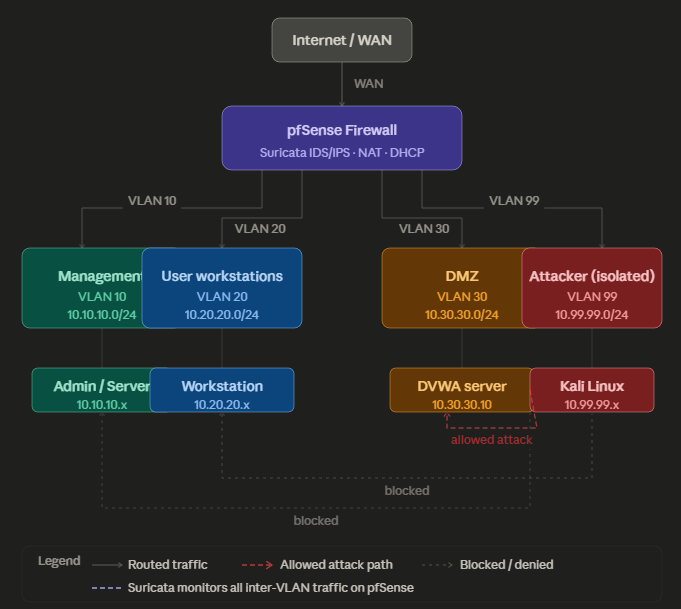 | Four-VLAN segmented network with pfSense core |

---

### 🔧 pfSense Configuration

| Screenshot | Description |
|------------|-------------|
| 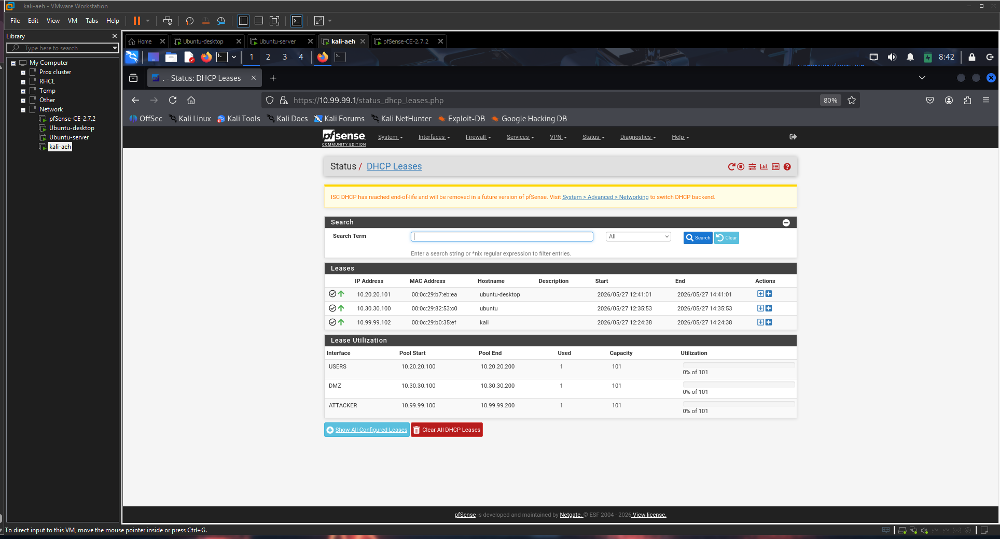 | Active DHCP leases across all four VLANs |
| 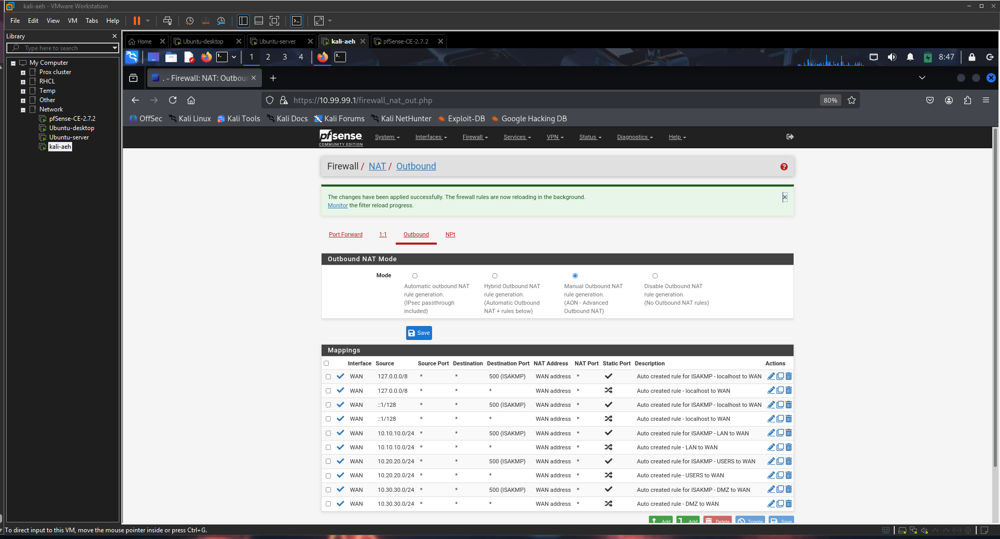 | Manual NAT with VLAN 99 rule deleted |

---

### 🛡️ Firewall Rules

| Screenshot | Description |
|------------|-------------|
| 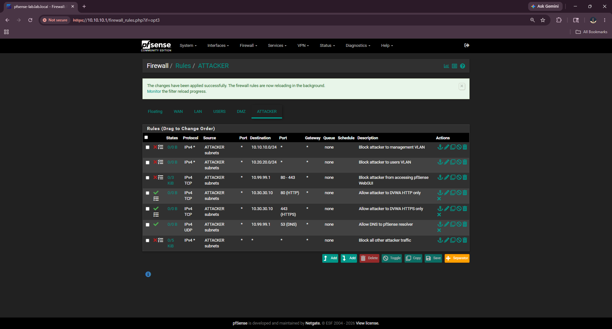 | VLAN 99 restricted to DMZ port 80/443 only |
| 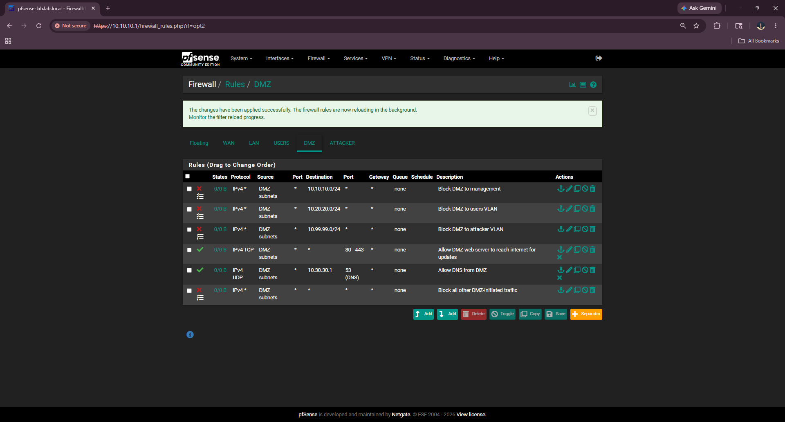 | DMZ blocked from initiating internal connections |
| 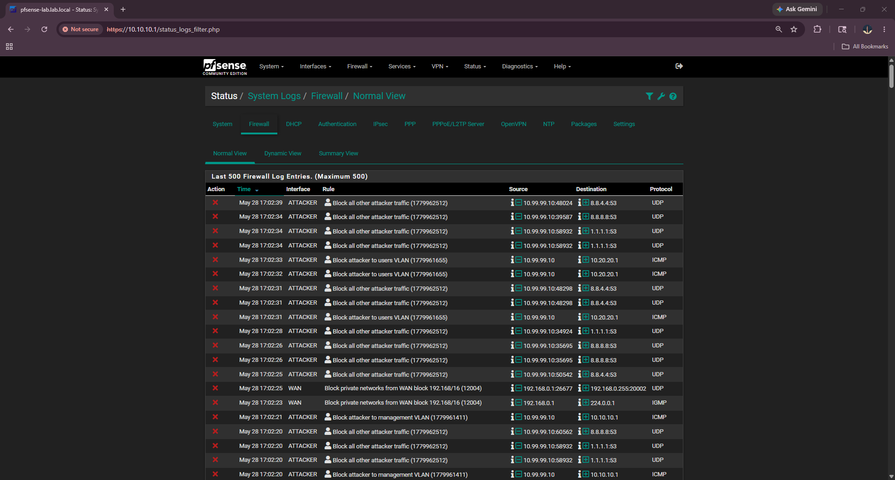 | Blocked traffic from Kali appearing in firewall logs |

---

### 🔍 Suricata IDS/IPS

| Screenshot | Description |
|------------|-------------|
| 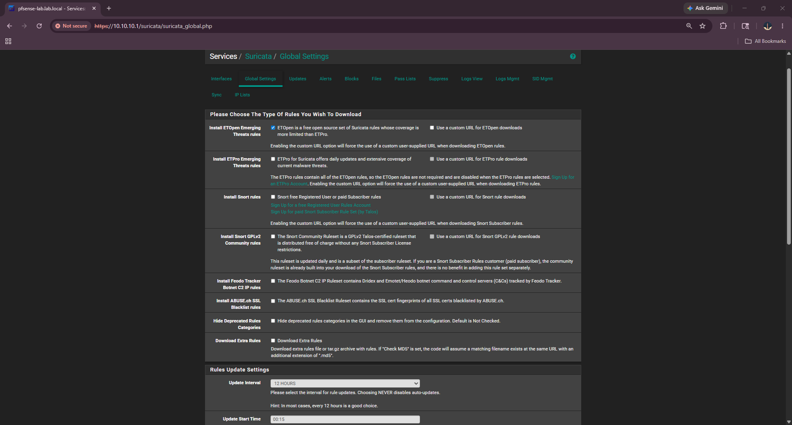 | Emerging Threats Open ruleset configured |
| 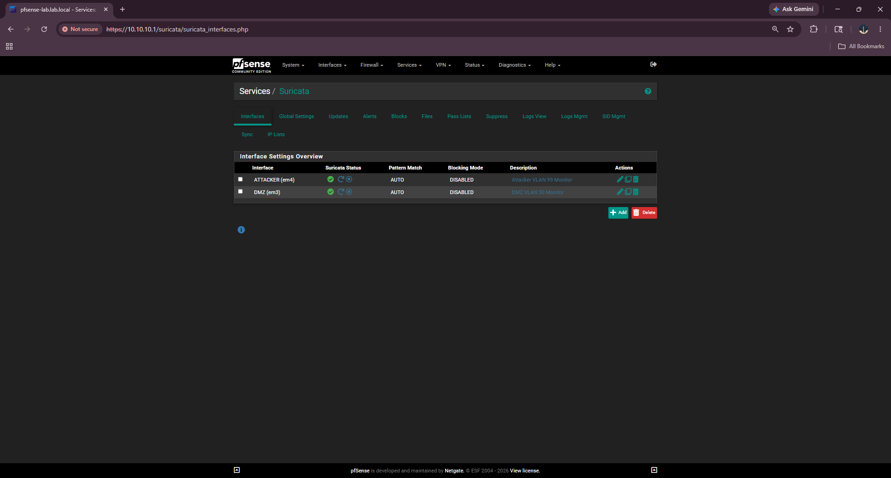 | Suricata active on ATTACKER and DMZ interfaces |

---

### ⚔️ Attack Simulation — Nmap Reconnaissance

| Screenshot | Description |
|------------|-------------|
| 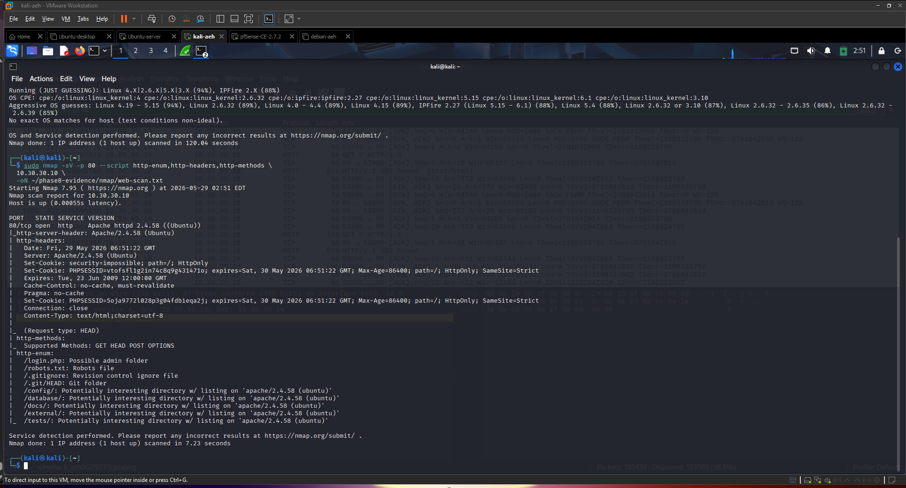 | Nmap host discovery finds pfSense and DVWA |
|  | Full port scan reveals ports 22, 80, 3306 open |

---

### 💉 Attack Simulation — SQL Injection

| Screenshot | Description |
|------------|-------------|
| 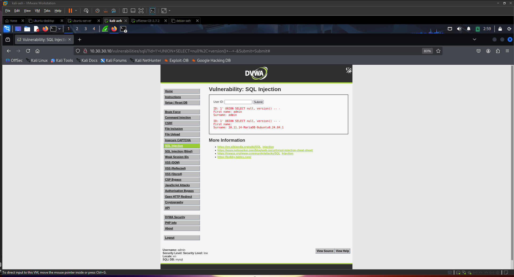 | UNION SELECT extracts database version string |
| 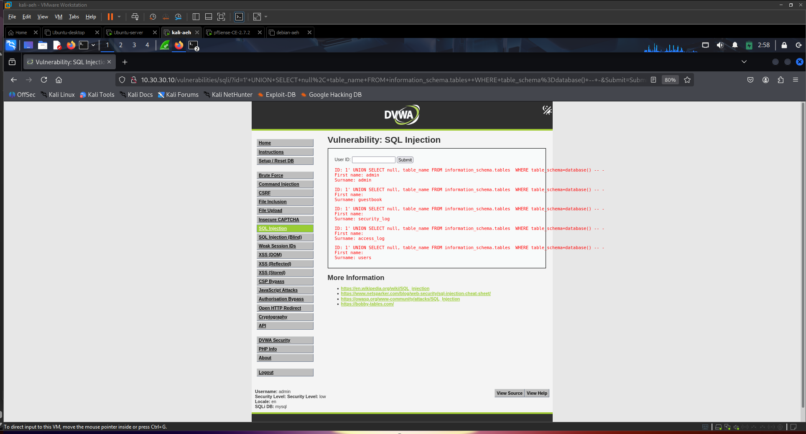 | Information schema reveals table names |


---

### 🖥️ Attack Simulation — Cross-Site Scripting

| Screenshot | Description |
|------------|-------------|
| 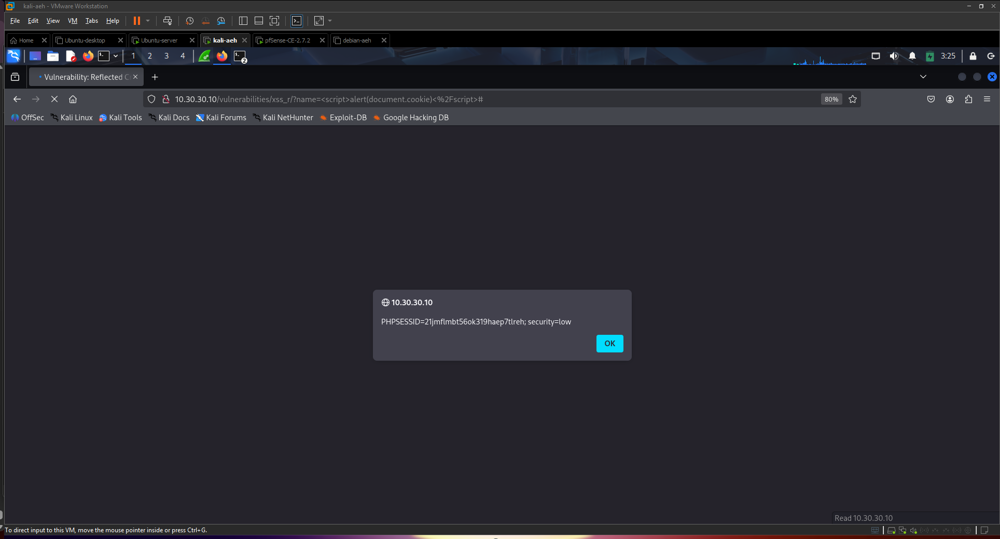 | Session cookie exposed via document.cookie |
| 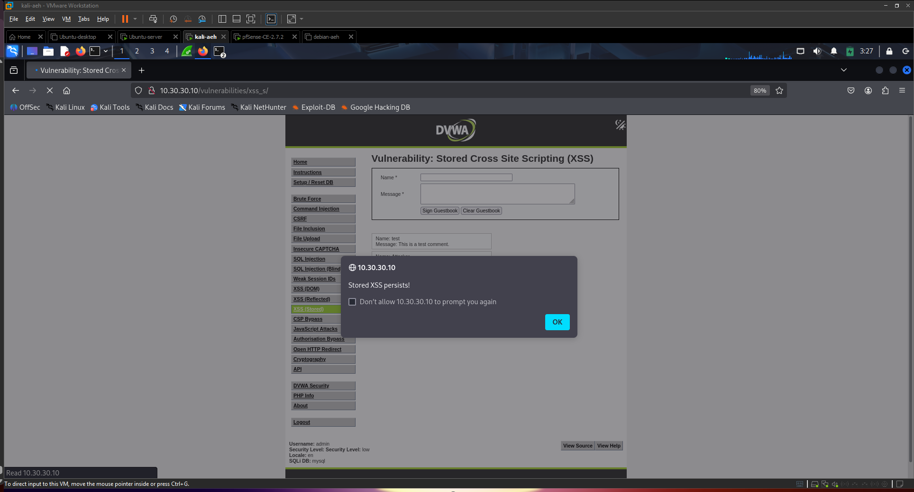 | Stored XSS payload fires on every page reload |

---

### 🚫 Blocked Attack Attempts

| Screenshot | Description |
|------------|-------------|
| 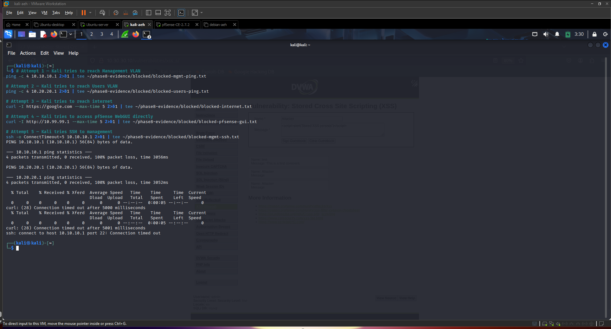 | Kali pings to Management and Users return 100% loss |
| 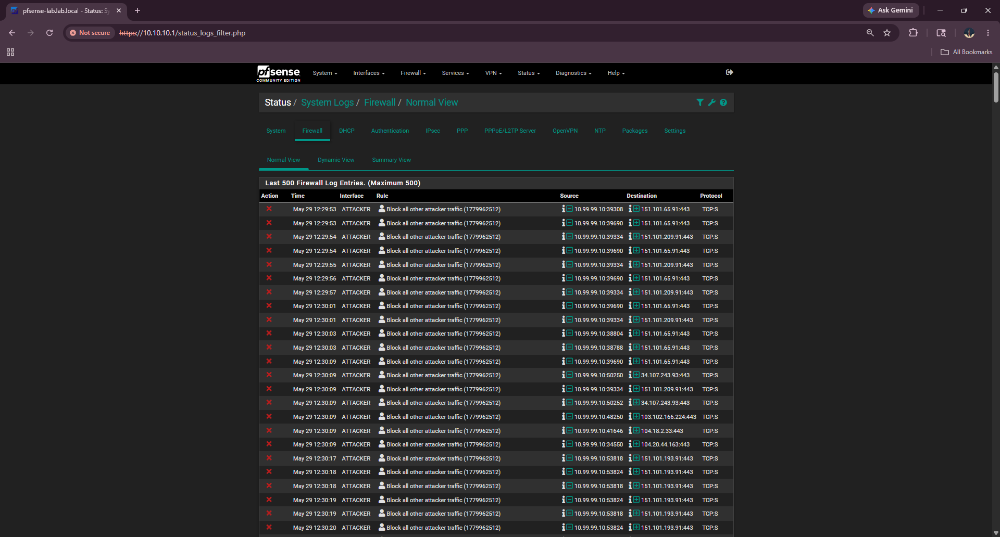 | pfSense logs show all blocked pivot attempts from 10.99.99.10 |


---

## Attacks Simulated and Detected

| Attack              | Tool    | Suricata Alert Fired              | Firewall Logged |
|---------------------|---------|-----------------------------------|-----------------|
| Host discovery      | Nmap    | ET SCAN Nmap host discovery       | —               |
| Port scan           | Nmap    | ET SCAN Nmap Version Scan         | —               |
| Web vuln scan       | Nikto   | ET WEB_SERVER Nikto Scanner       | —               |
| SQL injection       | Manual  | ET WEB_SERVER SQL Injection       | —               |
| Automated SQLi      | SQLMap  | ET WEB_SERVER SQLMap Activity     | —               |
| XSS reflected       | Manual  | ET WEB_SERVER XSS attempt         | —               |
| XSS stored          | Manual  | ET WEB_SERVER XSS stored          | —               |
| VLAN pivot attempt  | ping    | —                                 | BLOCKED ✅      |
| Internet breakout   | curl    | —                                 | BLOCKED ✅      |

---

## Project Structure

```
enterprise-network-security-lab/
├── README.md
├── report/
│   ├── enterprise-network-security-report.md
│   ├── firewall-rules-table.md
│   ├── attack-detection-table.md
│   └── lessons-learned.md
├── diagrams/
│   ├── network-topology.png
│   └── vlan-design.png
├── screenshots/          # 50+ screenshots across 10 phases
├── pcaps/                # Wireshark captures (nmap, nikto, sqlmap, blocked)
├── logs/                 # Suricata EVE JSON, pfSense firewall logs
├── configs/              # All configuration documentation
└── resume/               # Resume bullets and interview prep
```

---

## Key Findings

1. **VLAN segmentation is architectural** — disabling the pfSense firewall
   entirely still prevented Kali from reaching Management, because VMware
   Host-only networks are separate Layer 2 segments.

2. **Suricata detected SQLMap activity** — through Emerging Threats signatures 
   shortly after attack execution, demonstrating the effectiveness of IDS
   monitoring and alert correlation.

3. **Defence-in-depth works** — VLAN 99 is blocked from the internet at two
   independent layers: no NAT rule exists, and explicit firewall rules deny
   WAN access. Either layer alone is sufficient; both together are robust.

4. **IDS mode is essential before IPS mode** — running IDS first revealed
   which legitimate traffic would have been blocked by IPS, allowing rule
   tuning before enabling blocking.

---

## How to Reproduce This Lab

1. Install VMware Workstation Pro 17
2. Create VMnet2–5 as Host-only networks with DHCP disabled
3. Deploy pfSense CE with 5 NICs (one per VMnet)
4. Follow phase documentation in `/configs/` for full setup
5. Deploy DVWA on Ubuntu Server at 10.30.30.10
6. Install Suricata via pfSense Package Manager
7. Run attack simulation from Kali on VMnet5

Full phase-by-phase setup guide available in `/configs/`.

---

## Author

**Rushil Patel**

🔗 LinkedIn: [Rushil Patel](https://www.linkedin.com/in/rushil-patel-998669402/)

💻 GitHub: [Rushilpatel50](https://github.com/Rushilpatel50)

---

## 📄 License

This project is licensed under the [MIT License](LICENSE).
